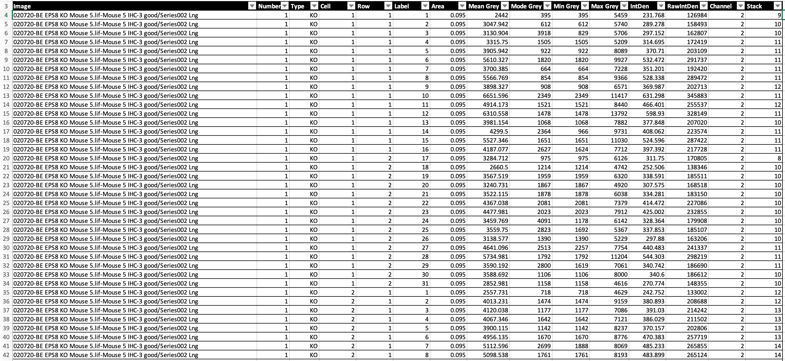
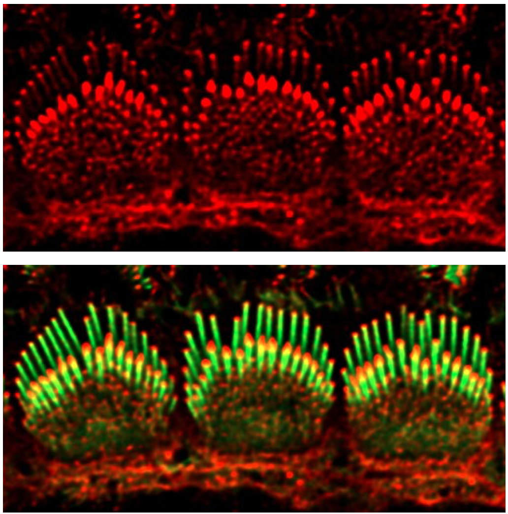

<font size="5">Package: Quick graphing specifically used for BE data</font>  
<br/>
<font size="5">Primary Aim</font>  
<font size="3">The primary aim of this package is to create functions for my lab to plot graphs from BE quantification, a dataset coming from a specific experiment of different objectives with same set of parameters. Without creating this package, there are several steps to accomplish plotting a graph of BE data. First, import files into excel and screen out certain groups and subgroups one by one. Second, calculate the average of subgroups and manually make a new sheet to add these newly generated data. Third, Transfer processed data to software-GraphPad Prism to do variance analysis and plot a graph. Fourth, make adjustment of graph characteristics such as font style, color, and manually add asterisks that represent significance on the Graph. Each of the steps above takes long time to go and seems to be repetitive work when we need to plot graphs of BE data from different objectives. This project aims to produce a function of one-step analysis to quickly plot an ideal graph of BE raw data. To accomplish this goal, the package will include several processes.  
1. Creat new tables which include processed data, such as average intensity, intensity ratio from row1/2. This could be challenging, because the intensity data come from different rows, cells and objectives (where cells come from). Solution will be writing a loop function to screen out specific row or cell to calculate mean value.  
2. Do t test or ANOVA test to find out the intensity significance among different rows, cells and objectives  
3. Plot customized graph to present data which have been processed by above methods  
Overall, the package will produce functions to transform raw data of BE quantification to ideal graphs with largely reduced steps</font>

```{r setup, include=FALSE}
library(QgraphB)
library(dplyr)
library(reshape2)
library(tidyr)
library(ggplot2)
library(ggpubr)
library(shiny)
library(miniUI)
```

<br/><br/>
<font size="4">Read dataset of BE Quantification</font>
```{r}
BE <- read.csv("BE Quantification.csv", stringsAsFactors = F)
```

<font size="4">Representative format of raw data from BE Quantification file</font>
```{r echo=FALSE, out.width = '100%'}

```
```{r echo=FALSE, out.width = '1%'}

```

<font size="4">Prework to remove NA data and creat new table with selective parameters for future use</font>
```{r}
## Remove individuals, type of which are missing, neither KO nor ctrl
BE1 <- BE %>% filter(Type == "KO" | Type == "ctrl")
## Choose parameters for future use
BE2 <-BE1[, c("Number", "Type", "Cell", "Row", "Label", "Mean.Grey")]
## Filter out different KO objectives
KO <- BE2 %>% filter(Type == "KO")
```
<font size="4">Function 1: Error report function</font>
```{r}
## Error report function for checking if the Area is less than 0.126 or if the Channel exactly equals to 2, otherwise, report FALSE
error_report(BE1)
```
<font size="4">Function 2: Combine the KO and ctrl loop function into r1r2_ratio  </font>
```{r}
## Subfunction 2-1: Example of calculating the intensity(mean.grey) ratio of row1/row2 in the range of cells from KO number 1.
KO1 <- KO %>% filter(Number == 1)
KO1_r1r2_ratio(KO1)
## Subfunction 2-2: In order to do that, KO1_r1r2_ratio function needs to be combined into a new function which is used to filter out various KOs. Results will show row1/row2 ratio of every cell from various KOs.
KO <- BE2 %>% filter(Type == "KO")
KO_r1r2_ratio(KO)
## Subfunction 2-3: Similar as KO_r1r2_ratio, ctrl_r1r2_ratio can be calculated in the same way
ctrl <- BE2 %>% filter(Type == "ctrl")
ctrl_r1r2_ratio (ctrl)
## Function 2
## r1r2_ratio <- function(df){
##  df <- BE2 %>% filter(Type == df)
##  x <- 1
##  storage <- numeric(max(df$Number))
##  for(x in 1:max(df$Number)){   ## loop out different objectives from either KO or ctrl
##  dfx <- df %>% filter(Number == x)
##  dfx_r1r2_ratio <- function(dfx) {
##  max <- max(dfx$Cell)
##  r1r2_ratio <- 1
##  for(n in 1:max){
##  row1 <- dfx %>% filter (Cell == n, Row == 1)
##  row2 <- dfx %>% filter (Cell == n, Row == 2)
##  r1r2_ratio[n] <- mean(row1$Mean.Grey) / mean(row2$Mean.Grey)}
## data <- data.frame(r1r2_ratio)
## return(data)
##   }
##  storage[x] <- dfx_r1r2_ratio(dfx)
##  }
##    return(storage)
KOratio <- r1r2_ratio("KO")
ctrlratio <- r1r2_ratio("ctrl")
```

<font size="4"> Function 3: Create table function to show Mean.Grey intensity in various cells</font>  
```{r}
## Function 3: create Table function, including unlist, cbind, rbind and name the data frame
Table("ctrl", "KO")
```

<font size="4"> Function 4: Create new daraframe for ggplot </font>  
```{r}
## Function 4: Create new dataframe which is used for ggplotting,including unlist, as.vector, create data frame with different lengths, collapse the dataframe and rebuild new charactor variables from row to columns by using melt() 
newdf <- newdf(KOratio, ctrlratio)
newdf
```

<font size="4"> Function 5-6: Create customized ggplot functions to plot "ratio value in control and knockouts"</font>  
```{r out.width = '100%'}
## Function 5: violinplot-Create customized violinplot function to plot "ratio value in control and knockouts"
violinplot(newdf)
## Function 6: boxplot-Create customized boxplot function to plot "ratio value in control and knockouts", including customized color, angle, heights of xy coordinates, size and color of texts and title
boxplot(newdf)
```
  
<font size="4"> Function 7-8: T-test of either boxplot or violinplot</font>  
```{r out.width = '100%'}
## Function 7: t_test_violinplot
t_test_violinplot(newdf)
## Function 8: t_test_boxplot
t_test_boxplot(newdf)

```

<font size="4"> Function 9: Shiny Gadget to pick data points of interest</font>  
```{r}
## By dragging mouse on the shiny plot, run pickpoints() will give you the detailed data that chosen by your mouse.
## pickpoints(newdf)
dataIpick <- pickpoints(newdf)
dataIpick

```
<br/> <br/>
<font size="5">Challenges listed in Midterm project</font>  
<font size="3">
1. FINISHED-I am now unable to produce a loop function to filter cells from certain objective or rows from certain cell.  
  Solution: Do more exercises on writing functions on Datacamp to get better understanding of how it works.  
2. FINISHED-Unable to generate a graph marked with significance asterisks.  
  Solution: Find a good function that covers the problem or learn how to add asterisks using ggplot function.  
3. FINISHED-Develop customized graphing functions.  
  Solution: Apply new plot style, graph size, font style or colour setting of my own choice.  
4. FINISHED-Check if parameters meet with requirements, for example, "Area" should be 0.095, "Channel" should be same in all rows.
  Solution: Write a function to check if data meet with requirement, otherwise report error
</font>
<br/><br/>

<font size="5">Future work and plans</font>  
<font size="3">
1. This package is only flexible with the "BE quantification.csv" file which contains same format of column names. Future work could be pursuing functions that are more flexible to screen out column of interest.  
2. Create more sub-functions to print out graphs showing detailed data analyses of some sub-groups, such as mean intensity of every cell from control-1, control-2, and control-3. And create anova test function. This function will give us a broadview of the individual differences of cells in one objective.  
3. Provide more kinds of plots functions for users to choose their favorite styles.  
</font>
<br/><br/>
<br/>
<br/>
<br/>
<br/>
<br/>
<br/>
<br/>
<br/>
<br/>
